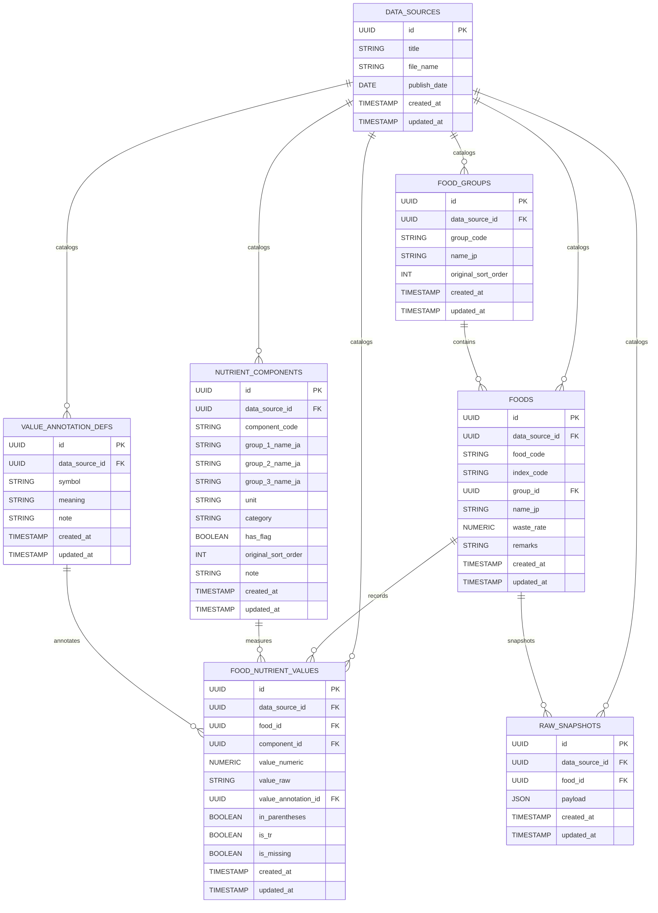

# 日本食品標準成分表（八訂・増補 2023）データベース要件

## 背景と目的

- データソース: csv
- 目的:
  Supabase上で分析・アプリ利用しやすい正規化スキーマを構築し、更新差分の取り込みと注記管理を容易にする

## ER 図（候補スキーマ）

## テーブル別要件

### data_sources

| 列名         | データ型    | 制約         | 役割・内容                            | 元データ参照                                      |
| ------------ | ----------- | ------------ | ------------------------------------- | ------------------------------------------------- |
| id           | UUID        | PK, NOT NULL | Supabase で生成 (uuid_generate_v4 等) | システム生成                                      |
| title        | TEXT        | NOT NULL     | データセット名                        | 手動入力                                          |
| file_name    | TEXT        | NOT NULL     | 参照ファイル名                        | resources/20230428-mxt_kagsei-mext_00001_012.xlsx |
| publish_date | DATE        | NULL 可      | 公表日                                | BJ1 更新日                                        |
| created_at   | TIMESTAMPTZ | NOT NULL     | 作成日時                              | システム生成                                      |
| updated_at   | TIMESTAMPTZ | NOT NULL     | 更新日時                              | システム生成                                      |

### food_groups

| 列名                | データ型    | 制約                         | 役割・内容                     | 元データ参照                 |
| ------------------- | ----------- | ---------------------------- | ------------------------------ | ---------------------------- |
| id                  | UUID        | PK, NOT NULL                 | 食品群識別子                   | システム生成                 |
| data_source_id      | UUID        | FK→data_sources.id, NOT NULL | 参照データセット               | 投入時に data_sources を参照 |
| group_code          | TEXT        | NOT NULL                     | 食品群コード (01〜18)          | 表全体 A 列                  |
| (UNIQUE)            |             |                              | `(data_source_id, group_code)` |                              |
| name_jp             | TEXT        | NOT NULL                     | 食品群名称                     | 各群シート名                 |
| original_sort_order | INT         | NOT NULL                     | Excel での順序                 | A 列の登場順                 |
| created_at          | TIMESTAMPTZ | NOT NULL                     | 作成日時                       | システム生成                 |
| updated_at          | TIMESTAMPTZ | NOT NULL                     | 更新日時                       | システム生成                 |

### foods

| 列名           | データ型    | 制約                         | 役割・内容                    | 元データ参照 |
| -------------- | ----------- | ---------------------------- | ----------------------------- | ------------ |
| id             | UUID        | PK, NOT NULL                 | 食品行識別子                  | システム生成 |
| data_source_id | UUID        | FK→data_sources.id, NOT NULL | 参照データセット              | 投入時       |
| food_code      | TEXT        | NOT NULL                     | 食品番号                      | 表全体 B 列  |
| (UNIQUE)       |             |                              | `(data_source_id, food_code)` |              |
| index_code     | TEXT        | NULL 可                      | 索引番号                      | 表全体 C 列  |
| group_id       | UUID        | FK→food_groups.id, NOT NULL  | 所属食品群                    | A 列と連動   |
| name_jp        | TEXT        | NOT NULL                     | 食品名                        | 表全体 D 列  |
| waste_rate     | NUMERIC     | NULL 可                      | 廃棄率                        | 表全体 E 列  |
| remarks        | TEXT        | NULL 可                      | 備考                          | 表全体 BJ 列 |
| created_at     | TIMESTAMPTZ | NOT NULL                     | 作成日時                      | システム生成 |
| updated_at     | TIMESTAMPTZ | NOT NULL                     | 更新日時                      | システム生成 |

### nutrient_components

| 列名                | データ型    | 制約                         | 役割・内容                           | 元データ参照           |
| ------------------- | ----------- | ---------------------------- | ------------------------------------ | ---------------------- |
| id                  | UUID        | PK, NOT NULL                 | 成分マスタ識別子                     | システム生成           |
| data_source_id      | UUID        | FK→data_sources.id, NOT NULL | 参照データセット                     | 投入時                 |
| component_code      | TEXT        | NOT NULL                     | 指標コード                           | 行 12 (コード行)       |
| (UNIQUE)            |             |                              | `(data_source_id, component_code)`   |                        |
| group_1_name_ja     | TEXT        | NOT NULL                     | 第 1 階層カテゴリ名 (例: ビタミン)   | 行 3 の分類            |
| group_2_name_ja     | TEXT        | NULL 可                      | 第 2 階層カテゴリ名 (例: ビタミン A) | 行 4〜7 の結合セル     |
| group_3_name_ja     | TEXT        | NULL 可                      | 第 3 階層・成分名 (例: レチノール)   | 行 12 (コード行と同列) |
| unit                | TEXT        | NULL 可                      | 単位                                 | 行 11 等               |
| category            | TEXT        | NOT NULL                     | カテゴリ                             | 行 3 の分類            |
| has_flag            | BOOLEAN     | NOT NULL, default false      | 補助列フラグ                         | O/R 列有無             |
| original_sort_order | INT         | NOT NULL                     | Excel 列順                           | 列番号                 |
| note                | TEXT        | NULL 可                      | 備考                                 | 任意入力               |
| created_at          | TIMESTAMPTZ | NOT NULL                     | 作成日時                             | システム生成           |
| updated_at          | TIMESTAMPTZ | NOT NULL                     | 更新日時                             | システム生成           |

### food_nutrient_values

| 列名                | データ型    | 制約                                 | 役割・内容                                | 元データ参照       |
| ------------------- | ----------- | ------------------------------------ | ----------------------------------------- | ------------------ |
| id                  | UUID        | PK, NOT NULL                         | 食品 × 成分値                             | システム生成       |
| data_source_id      | UUID        | FK→data_sources.id, NOT NULL         | 参照データセット                          | 投入時             |
| food_id             | UUID        | FK→foods.id, NOT NULL                | 食品                                      | 表全体 行 B 列     |
| component_id        | UUID        | FK→nutrient_components.id, NOT NULL  | 成分                                      | F〜BI 列           |
| (UNIQUE)            |             |                                      | `(data_source_id, food_id, component_id)` | 重複防止           |
| value_numeric       | NUMERIC     | NULL 可                              | 数値化した値                              | セルの数値解釈     |
| value_raw           | TEXT        | NOT NULL                             | 原文                                      | セル文字列         |
| value_annotation_id | UUID        | FK→value_annotation_defs.id, NULL 可 | 注記                                      | O/R 列・セル内記号 |
| in_parentheses      | BOOLEAN     | NOT NULL, default false              | 括弧フラグ                                | セル解析           |
| is_tr               | BOOLEAN     | NOT NULL, default false              | 微量フラグ                                | セル解析           |
| is_missing          | BOOLEAN     | NOT NULL, default false              | 欠測フラグ                                | セル解析           |
| created_at          | TIMESTAMPTZ | NOT NULL                             | 作成日時                                  | システム生成       |
| updated_at          | TIMESTAMPTZ | NOT NULL                             | 更新日時                                  | システム生成       |

### value_annotation_defs

| 列名           | データ型    | 制約                         | 役割・内容                 | 元データ参照        |
| -------------- | ----------- | ---------------------------- | -------------------------- | ------------------- |
| id             | UUID        | PK, NOT NULL                 | 注記識別子                 | システム生成        |
| data_source_id | UUID        | FK→data_sources.id, NOT NULL | 参照データセット           | 投入時              |
| symbol         | TEXT        | NOT NULL                     | 注記記号                   | O/R 列・セル記号    |
| (UNIQUE)       |             |                              | `(data_source_id, symbol)` |                     |
| meaning        | TEXT        | NOT NULL                     | 注記の意味                 | BJ 列備考・資料脚注 |
| note           | TEXT        | NULL 可                      | 補足説明                   | 備考                |
| created_at     | TIMESTAMPTZ | NOT NULL                     | 作成日時                   | システム生成        |
| updated_at     | TIMESTAMPTZ | NOT NULL                     | 更新日時                   | システム生成        |

### raw_snapshots

| 列名           | データ型    | 制約                         | 役割・内容                                    | 元データ参照     |
| -------------- | ----------- | ---------------------------- | --------------------------------------------- | ---------------- |
| id             | UUID        | PK, NOT NULL                 | スナップショット識別子                        | システム生成     |
| data_source_id | UUID        | FK→data_sources.id, NOT NULL | 参照データセット                              | 投入時           |
| food_id        | UUID        | FK→foods.id, NOT NULL        | 対象食品                                      | 投入時           |
| payload        | JSONB       | NOT NULL                     | 元行情報（食品コード・値・注記等を含む JSON） | 取り込み時に生成 |
| created_at     | TIMESTAMPTZ | NOT NULL                     | 作成日時                                      | システム生成     |
| updated_at     | TIMESTAMPTZ | NOT NULL                     | 更新日時                                      | システム生成     |
| (UNIQUE)       |             |                              | `food_id`                                     | 1食品1スナップ   |
